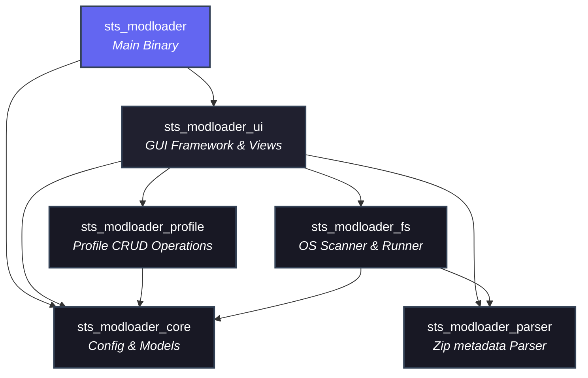

# Slay the Spire Mod Loader (STS Modloader)

[](https://www.rust-lang.org)
[](https://github.com/iced-rs/iced)
[](#)
[](#)

A lightweight, modern, and high-performance native Rust GUI alternative to the standard Java-based **ModTheSpire** launcher. Built with the **Iced** GUI framework and powered by **Tokio**'s asynchronous runtime, this mod loader offers a clean, fluid user interface designed around a custom slate-and-indigo dark theme.

---

## 📖 Table of Contents
1. [Project Overview](#-project-overview)
2. [Key Features](#-key-features)
3. [Architecture & Layout](#-architecture--layout)
4. [Data Models & Config Schemas](#-data-models--config-schemas)
5. [Prerequisites & Build Guide](#-prerequisites--build-guide)
6. [Usage Instructions](#-usage-instructions)
7. [UI Layout & Dark Theme Styling](#-ui-layout--dark-theme-styling)
8. [License & Acknowledgments](#-license--acknowledgments)

---

## 🔍 Project Overview

The traditional Java ModTheSpire launcher has served the *Slay the Spire* modding community for years, but suffers from slow startup times, a dated Swing interface, and a lack of built-in profile managers. 

This **Slay the Spire Mod Loader** re-imagines the launcher experience in Rust:
* **Native GUI**: Uses the hardware-accelerated **Iced** framework (via WGPU/Tiny-skia) resulting in instant startup, zero JVM GUI overhead, and smooth layouts.
* **Elm Architecture**: Implements a strict unidirectional data flow (Model-View-Update), guaranteeing predictable state changes and thread safety.
* **Asynchronous Design**: All heavy disk IO (directory scanning, registry lookups) and process management run in the background via Tokio tasks, keeping the UI at a locked 60+ FPS.

---

## ✨ Key Features

* **Intelligent Auto-Detection**:
  * On **Windows**, queries Registry keys (`Software\Valve\Steam`) to locate the Steam installation.
  * On **Linux**, searches standard home paths (`~/.local/share/Steam`).
  * Parses Steam's `libraryfolders.vdf` to find secondary game libraries automatically, locate the *Slay the Spire* directory, and scan for mods.
  * Automatically locates `ModTheSpire.jar` in either the local game directory or the Steam Workshop directory (`workshop/content/646570/1605060445/ModTheSpire.jar`).
  * Automatically locates the Java executable (e.g. `java.exe` or `java`) on the system by searching the `JAVA_HOME` environment variable, probing Windows Registry entries (`SOFTWARE\JavaSoft\JDK`, `SOFTWARE\JavaSoft\Java Runtime Environment`, `SOFTWARE\JavaSoft\Java Development Kit`), enumerating directories under `C:\Program Files\Java`, checking common locations, and falling back to searching `PATH`.
* **Mod Profile Clipboard Export/Import**: Copy the currently enabled mod selection list to the system clipboard (in comma-separated format) or import a list of mods from clipboard (supporting comma-separated, semicolon-separated, or newline-separated formats) to automatically configure mod states.
* **CJK Character Support**: Configures system-native fonts supporting CJK (Microsoft YaHei on Windows, PingFang SC on macOS, or Noto Sans CJK SC on Linux) as the default UI font, enabling seamless rendering of hieroglyphs in mod names, authors, and descriptions.
* **Manual Setup Picker**: Fallback directory browser utilizing native system dialogs (`rfd`) if paths cannot be resolved automatically.
* **In-Memory Metadata Parser**: Streams and deserializes the internal `ModTheSpire.json` directly from `.jar` files in-memory without extracting them to disk.
* **Polymorphic Author Parser**: Normalizes inconsistent author specifications (e.g. singular string author, comma-separated lists, JSON arrays) into a flat vector.
* **Profile Management**: Complete CRUD interface to save current active mod selections under custom named profiles (e.g., "Downfall Mod Pack", "Base Config") stored in a central application config.
* **Dependency & Conflict Resolver**: Computes status maps showing whether mod dependencies (e.g., BaseMod, Stslib) are **Satisfied**, **Disabled**, or **Missing**, displaying alert badges in the UI.
* **Headless Java Runner**: Updates Java's `%LOCALAPPDATA%/ModTheSpire/ModTheSpire.properties` and spawns the headless game command (`<java_path> -jar ModTheSpire.jar --skip-launcher`) using the auto-detected Java runtime.
* **Error Interception**: If the game crashes or Java fails to boot, the loader captures the `stderr` buffer and outputs it in a dark modal dialog to simplify troubleshooting.

---

## 🛠️ Architecture & Layout

The project is structured as a Cargo workspace containing **one orchestrator binary crate** and **five supporting library crates** to maintain strict separation of concerns:

```text
sts_modloader_root/
├── Cargo.toml                       # Workspace root configuration
├── sts_modloader/                   # Main Entry Binary Crate
│   └── src/main.rs                  # Starts the GUI loop & configures size (1024x600)
├── sts_modloader_core/              # Common Types & Configuration
│   └── src/
│       ├── lib.rs
│       └── config.rs                # AppConfig struct & JSON serialization
├── sts_modloader_fs/                # File System IO, Steam Registry & Java Launcher
│   └── src/
│       ├── lib.rs
│       ├── steam.rs                 # Registry check & libraryfolders.vdf parser
│       ├── scanner.rs               # Async local & workshop jar scanning (walkdir)
│       └── runner.rs                # ModTheSpire.properties writer & subprocess spawner
├── sts_modloader_parser/            # Zip Archive Metadata Extraction
│   └── src/
│       ├── lib.rs
│       └── metadata.rs              # Streaming ModTheSpire.json zip parser & normalizer
├── sts_modloader_profile/           # Profiles Business Logic
│   └── src/
│       ├── lib.rs
│       └── manager.rs               # Profile CRUD (create, delete, edit)
└── sts_modloader_ui/                # State Machine, Widgets & Theme Styling
    └── src/
        ├── lib.rs
        ├── app.rs                   # Iced Application state model & update function
        ├── styles.rs                # Theme color palettes & widget StyleSheet implementations
        └── components/              # Individual modular layout panels
            ├── setup_screen.rs      # Welcome/Path setup page
            ├── control_block.rs     # Profiles PickList & CRUD action buttons
            ├── left_panel.rs        # Mod lists, check-boxes, and search inputs
            ├── right_panel.rs       # Selected mod details, dependencies, and warning badges
            └── bottom_bar.rs        # Debug toggles, status reports, and Play button
```

### Dependency Graph



---

## 🗄️ Data Models & Config Schemas

### 1. ModTheSpire.json
Every Slay the Spire mod `.jar` includes a `ModTheSpire.json` at its root. The loader streams and normalizes this structure:

```json
{
  "modid": "basemod",
  "name": "BaseMod",
  "author_list": ["t-larson", "kiooeht", "daviscook"],
  "version": "5.44.0",
  "description": "An API for modding Slay the Spire.",
  "dependencies": ["ModTheSpire"],
  "sts_version": "2.0",
  "mts_version": "3.18.0"
}
```

### 2. Application Config (`modloader_config.json`)
Saves configuration and profile lists. Stored in:
* **Windows**: `%APPDATA%/sts_modloader/modloader_config.json`
* **Linux/macOS**: `~/.config/sts_modloader/modloader_config.json`

```json
{
  "sts_path": "D:\\SteamLibrary\\steamapps\\common\\SlayTheSpire",
  "debug_mode": false,
  "profiles": [
    {
      "name": "Base Config",
      "enabled_mods": ["basemod", "stslib"]
    },
    {
      "name": "Downfall Mod Pack",
      "enabled_mods": ["basemod", "stslib", "downfall"]
    }
  ],
  "active_profile": "Base Config"
}
```

### 3. ModTheSpire Java Properties (`ModTheSpire.properties`)
Written to `%LOCALAPPDATA%/ModTheSpire/ModTheSpire.properties` to specify active mods to the headless ModTheSpire launcher:

```properties
# Written by Slay the Spire Mod Loader
mods=basemod,stslib,downfall
debug=true
debug_mode=true
```

---

## 🚀 Prerequisites & Build Guide

### Prerequisites
1. **Rust Toolchain**: Install Rustup and switch to the stable Rust compiler (edition 2021).
2. **Java Runtime Environment (JRE)**: Java 8 (specifically JRE/JDK 8) must be installed and added to your system `PATH` variable (or configured via `JAVA_HOME`). This is required because Slay the Spire and ModTheSpire are Java-based applications, and ModTheSpire specifically relies on Java 8 features and compatibility.
3. **Steam Installation**: Slay the Spire must be installed via Steam (so that `ModTheSpire.jar` and the game jars like `desktop-1.0.jar` are available).

### Compilation Commands

Run the following commands from the root directory of the workspace:

* **Build the workspace (Debug mode)**:
  ```bash
  cargo build
  ```

* **Build the workspace (Optimized Release mode)**:
  ```bash
  cargo build --release
  ```

* **Run all Unit Tests**:
  ```bash
  cargo test
  ```

* **Run the application**:
  ```bash
  cargo run --bin sts_modloader
  ```

---

## 🎮 Usage Instructions

### 1. First Boot & Setup
If the application does not find the game path during startup, it displays a **Setup Screen**:
* Click **Auto Detect** to scan standard Steam registry keys and library directories.
* If detection fails, click **Browse Folder** to open a native file dialog and select your game's root directory (the directory containing `desktop-1.0.jar` and `ModTheSpire.jar`).

### 2. Mod List & Filters
* **Searching**: Use the search input box at the top of the left panel to filter mods by name or mod ID (case-insensitive).
* **Toggle Selections**: Click individual checkboxes to enable/disable mods. Or, click the **Toggle All** button (checkbox icon) in the control panel to enable/disable only the mods *currently matching the search query*.
* **Syncing**: Click the **Refresh** button in the control panel to rescan directories for new or updated JARs.

### 3. Profiles
* Select an existing profile from the dropdown picker to load it immediately.
* To create a profile: Click the **`+`** button, type in a profile name, and press **Enter** (or click Save). The current enabled mod state will be bound to this profile.
* To delete a profile: Select the profile in the dropdown, and click the **`-`** button. (Note: The default "Default" profile cannot be deleted).

### 4. Running the Game
* Toggle **Enable Debug Console Mode** at the bottom left to enable debug logging.
* Click **PLAY GAME** to write selections and start Slay the Spire. The UI will change to a locked "Game Running..." state.
* If a crash occurs or Java fails to launch, the loader will display a red stderr modal.

---

## 🎨 UI Layout & Dark Theme Styling

The window dimensions are fixed to a compact, sleek **1024x600** px:

```text
+---------------------------------------------------------------------------------------------------+
|  [Profile Selection: PickList]   [+] [-]                     [Refresh List Button]  [Status: OK]   |
+---------------------------------------------------------------------------------------------------+
|  SEARCH: [  Filter mods...      ] |  MOD DETAILS:                                                 |
|                                  |  ============================================================  |
|  [X] BaseMod              v5.44  |  BaseMod (v5.44.0)                                             |
|  [X] Stslib               v2.10  |  Authors: t-larson, kiooeht, daviscook                         |
|  [ ] Downfall             v4.20  |  Target Game Version: 2.0  | MTS version: 3.18                 |
|  [ ] RelicStats           v2.01  |  ------------------------------------------------------------  |
|                                  |  An API for modding Slay the Spire. Adds custom cards, relics, |
|                                  |  events, campaigns, and debug facilities.                      |
|                                  |                                                                |
|                                  |  Dependencies:                                                 |
|                                  |  - ModTheSpire  [Satisfied]                                    |
|                                  |  - Stslib       [Warning: Disabled]                            |
+---------------------------------------------------------------------------------------------------+
|  [X] Enable Debug Console Mode                        |               [ PLAY GAME BUTTON ]        |
+---------------------------------------------------------------------------------------------------+
```

### Theme Colors (Slate-Indigo Palette)

The styles are configured via custom `iced` stylesheet traits (`iced::widget::container::StyleSheet`, `iced::widget::button::StyleSheet`, etc.) in `styles.rs`:

| Variable | Color (Hex) | Color (RGB) | Description / Usage |
|:---|:---:|:---:|:---|
| **Primary Background** | `#181824` | `rgb(24, 24, 36)` | Main application window background |
| **Panel Background** | `#20202F` | `rgb(32, 32, 47)` | Left and right panel boxes, input backgrounds |
| **Text Foreground** | `#E2E8F0` | `rgb(226, 232, 240)` | High-contrast body and title text |
| **Muted Text** | `#94A3B8` | `rgb(148, 163, 184)` | Secondary info, versions, authors |
| **Accent Active** | `#6366F1` | `rgb(99, 102, 241)` | Selection highlights, border focus, accent buttons |
| **Play (Normal)** | `#10B981` | `rgb(16, 185, 129)` | Primary Call-To-Action (Play Game) |
| **Play (Running)** | `#EF4444` | `rgb(239, 68, 68)` | Warning modal highlights, stopping game |
| **Borders** | `#334155` | `rgb(51, 65, 85)` | Panel dividing lines, input borders |

---

## 📄 License & Acknowledgments

* **License**: Distributed under the MIT License.
* **Libraries Used**:
  * [Iced GUI](https://github.com/iced-rs/iced) - Native Elm-style UI rendering.
  * [Tokio](https://github.com/tokio-rs/tokio) - Async I/O engine.
  * [Serde & Serde JSON](https://serde.rs) - Serialization framework.
  * [Walkdir](https://github.com/BurntSushi/walkdir) - File scanning.
  * [Zip](https://github.com/zip-rs/zip2) - In-memory archive extraction.
  * [RFD](https://github.com/Polyfrost/rfd) - Native file dialogues.
